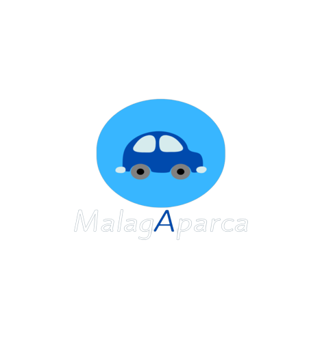

# MalagAparca
MalagAparca es una app que gestiona unas plazas de parking, para que usuarios puedan ser asignados dependiendo del tipo de vehículo que requieran.

## Vídeo explicativo
Un vídeo explicando el funcionamiento de MalagAparca: https://www.youtube.com/watch?v=GqTGcxxuzz0&ab_channel=DiegoRodri

## Home
Esta es la primera interfaz de mi app, que contiene un slider con una pequeña introducción de lo que es la app.

## Usuarios
El apartado de usuarios, donde se encontrarán los usuarios con sus respectivos nombres y vehículos

## Plazas
El apartado de aparcamientos, donde se encontrarán los aparcamientos con sus respectivas localizaciones y tipo de vehículo

## Asignamiento
El apartado de asignamiento de plazas, donde asignaremos las plazas a los usuarios.

## Añadir, editar y borrar
En las diferentes interfaces, podremos añadir, editar y borrar.

## Contacto

Aquí una página de contacto donde podrás conocerme mejor

## Traducción

La app cuenta con un servicio de traducción.

## Conclusión

Este trabajo me ha resultado muy útil ya que he podido plasmar lo aprendido en clase en un proyecto por cuenta propia. Me llena de motivación y felicidad haber aprendido tanto de Angular e Ionic durante este primer trimestre, ya que antes de que empezara no tenía ningún conocimiento de estos lenguajes
